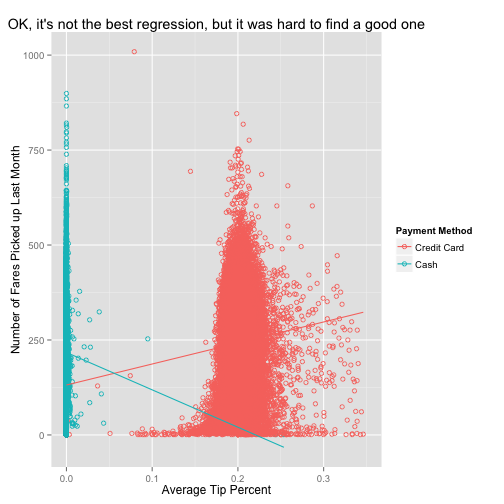

Tipping a Cabbie: What's tip-ical*?
========================================================
author: Reid Offringa, PhD
date: 9/21/14
*this is a joke, not a misspelling

How much are peopling tipping cab drivers?
========================================================

We'll download data, explore it with ggplot and build a regression.  

A summary of what you'll see

- Basically, zero cab drivers reported their cash tips, in this sample.
- There is a subtle, positive relationship between the number of fares and tip percent.
- Not shown: There is a subtle, negative relationship between monthly income and tip percent. 
- To be clear, "typical" is the way it's usually spelled. 

First, we download the data and load some packages:
========================================================


```r
require(RCurl)
require(utils)
require(caret)

URL<-"https://dl.dropboxusercontent.com/s/62vvnbcwl5u3xth/DF.csv"

download.file(URL, destfile = "./taxi.csv", method="curl")

taxi<-read.csv("taxi.csv")
```
Then, I used the Caret package to build a linear regression
========================================================
- But wait, how do we predict the average tip percent for an individual cab driver?


```r
tip<-train(mean_tip~ payment_type+count+fare_amount+
                       payment_type*count+count*fare_amount,
                   data=taxi, method = "glm") #Everything is linear! Hooray! 
```

We can predict an individual's average tip with a Shiny App! 
========================================================
+ I don't have room to show the coefficients, so here's a graph:
 
